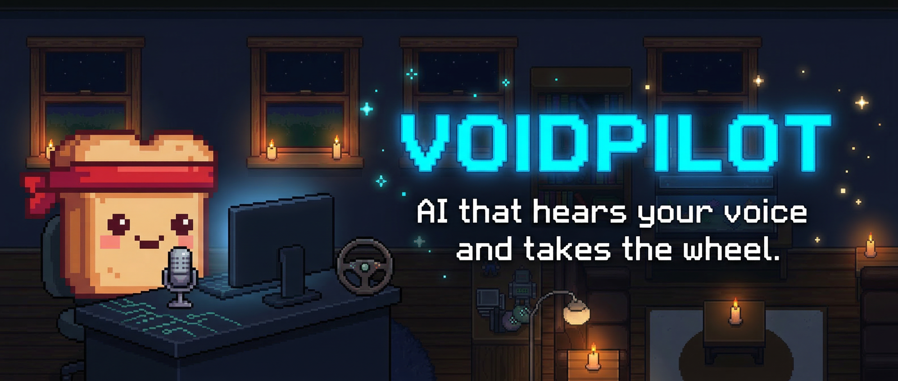
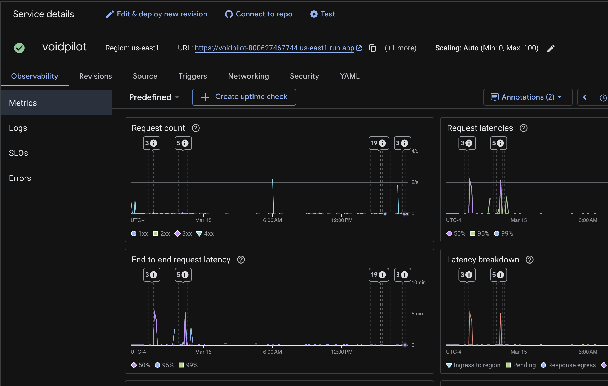

<div align="center">



[](https://hackathon.remembr-ai.com)
[](#demo-video)

<br/>

[](https://cloud.google.com/run/docs)
[](https://cloud.google.com/vertex-ai/generative-ai/docs/live-api)
[](https://cloud.google.com/vertex-ai/generative-ai/docs/sdks/overview)
[](https://firebase.google.com/docs/auth)
[](https://fastapi.tiangolo.com/)
[](https://react.dev/)
[](https://tailwindcss.com/)
[](https://python.org/)
[](https://typescriptlang.org/)
[](#)

<br/>

**Voidpilot is a next-generation multimodal AI agent that breaks the text-box paradigm.**
**Talk naturally. Generate visuals in real-time. Brainstorm with AI that sees, hears, and creates.**

Built for the [Gemini Live Agent Challenge](https://geminiliveagentchallenge.devpost.com/) | **Live Agents** + **Creative Storyteller** Categories

</div>

---

## The Problem

Current AI assistants are trapped in text boxes. You type, you wait, you read. But real creative collaboration is **fluid** — it's voice-first, visual, and happens in real-time. Nobody brainstorms by typing paragraphs back and forth.

## The Solution

Voidpilot connects your microphone directly to Gemini Live over WebSocket, creating an **immersive voice-first AI experience** where you can:

- **Talk naturally** — real-time voice streaming with low-latency turn-taking
- **Generate images and videos** on the fly while talking — say "show me what that looks like" and watch it appear
- **Build structured artifacts** — documents, plans, creative briefs — all through voice
- **Share your sessions** with a single link — anyone can view the full conversation and download generated assets

---

## Modes

### Voice Assistant (Live Mode)
> *Real-time voice conversation with Gemini Live*

The core experience. Low-latency bidirectional audio streaming over WebSocket with real-time transcription and natural turn-taking.

### Open Studio (Brainstorm Mode)
> *Full-featured creative workspace with multi-agent orchestration*

A voice-driven brainstorm environment with a pixel-art office visualization. Gemini coordinates with Flash models to generate **markdown artifacts**, **images**, and **videos** — all while you talk. Session persistence via Firebase lets you pick up right where you left off.

**Key capabilities:**
- `save_brainstorm_artifact` — structured markdown documents
- `generate_brainstorm_image` — real-time image generation
- `delegate_to_flash` — multi-agent delegation to Flash models
- Session library with auto-generated titles
- Download individual assets or everything as a ZIP

### Creative Spark (Brainstorm Mode)
> *Guided visual inspiration with auto-start conversations*

A streamlined mode focused purely on visual generation. The AI starts the conversation with a creative prompt, and a full-screen **masonry gallery** fills with generated images and videos as you talk. No buttons, no toggles — just you and the AI creating together.

### Walkthrough Mode
> *Voice-guided exploration with custom system prompts*

Embeddable voice overlay for guided experiences. Pass a custom system prompt via query parameters and get a voice-first walkthrough of any topic.

---

## Architecture

<div align="center">

</div>

---

## Tech Stack

| Layer | Technology |
|-------|-----------|
| **AI / LLM** | Gemini 2.5 Flash (Live API), Google GenAI SDK, multi-model delegation |
| **Backend** | FastAPI, Python 3.12+, WebSocket streaming, `pydantic-settings` |
| **Frontend** | React 19, Vite 7, TypeScript 5.9, Tailwind v4, shadcn/ui, Framer Motion |
| **Auth & Data** | Firebase Auth (Email + Google), Firestore, Cloud Storage |
| **Deployment** | Google Cloud Run, multi-stage Docker build |
| **Audio** | 16kHz PCM capture, 24kHz playback, real-time transcription |
| **Package Mgmt** | `uv` (Python), `npm` (Frontend) |

---

## Google Cloud Services Used

| Service | Purpose |
|---------|---------|
| [**Cloud Run**](https://cloud.google.com/run/docs) | Hosts the containerized FastAPI backend + static frontend |
| [**Gemini Live API**](https://cloud.google.com/vertex-ai/generative-ai/docs/live-api) | Real-time bidirectional audio/text streaming via [`google-genai` SDK](https://cloud.google.com/vertex-ai/generative-ai/docs/sdks/overview) |
| [**Firebase Auth**](https://firebase.google.com/docs/auth) | User authentication (Email/Password + Google Sign-In) |
| [**Firestore**](https://firebase.google.com/docs/firestore) | Session metadata, transcript persistence, artifact records |
| [**Cloud Storage**](https://firebase.google.com/docs/storage) | Generated image/video/markdown artifact storage |

---

## Quick Start

### Prerequisites

- Python 3.12+
- Node.js 22+
- [uv](https://docs.astral.sh/uv/) package manager
- A [Google API Key](https://aistudio.google.com/apikey) with Gemini access

### 1. Clone & Install

```bash
git clone https://github.com/AshishT558/gemini-live-3d-bridge.git
cd gemini-live-3d-bridge

# Python dependencies
uv sync

# Frontend dependencies
cd frontend && npm install && cd ..
```

### 2. Configure Environment

```bash
cat > .env << 'EOF'
GOOGLE_API_KEY=your_google_api_key

# Optional: Required for brainstorm session persistence
FIREBASE_PROJECT_ID=your_firebase_project_id
FIREBASE_STORAGE_BUCKET=your_firebase_storage_bucket
EOF
```

> Guest mode works without Firebase. Firebase is only needed for persistent sessions, auth, and artifact storage.

### 3. Run

```bash
# Option A: Combined dev server
bash scripts/dev.sh

# Option B: Separate terminals
uv run uvicorn src.app.main:app --host 127.0.0.1 --port 8000   # Backend
cd frontend && npm run dev                                        # Frontend
```

Open **http://localhost:5173** and start talking.

---

## Deployment (Google Cloud Run)

The app ships as a single multi-stage Docker image: frontend is built as static assets and served by FastAPI.

```bash
gcloud run deploy voidpilot \
  --source . \
  --region us-east1 \
  --port 8080 \
  --allow-unauthenticated
```

**Live at:** [hackathon.remembr-ai.com](https://hackathon.remembr-ai.com)

<div align="center">

<br/><em>Live Cloud Run dashboard showing Voidpilot request metrics, latencies, and scaling in us-east1</em>
</div>

---

## Project Structure

```
voidpilot/
├── src/app/
│   ├── main.py                      # FastAPI app, CORS, static serving
│   ├── api/v1/
│   │   ├── router.py                # API router
│   │   └── endpoints/
│   │       ├── live.py              # Voice assistant WebSocket
│   │       ├── brainstorm.py        # Brainstorm mode WebSocket
│   │       └── walkthrough.py       # Walkthrough mode WebSocket
│   ├── services/
│   │   ├── gemini_audio.py          # GeminiLive session wrapper
│   │   └── flash_worker.py          # Flash model delegation
│   └── core/
│       └── config.py                # pydantic-settings config
├── frontend/
│   ├── src/
│   │   ├── pages/                   # LandingPage, BrainstormPage, SharePage
│   │   ├── components/brainstorm/   # Mode selection, layouts, controls
│   │   └── hooks/                   # useGeminiLive, useGeminiBrainstorm
│   └── package.json
├── tests/                           # pytest test suite
├── Dockerfile                       # Multi-stage Cloud Run build
├── pyproject.toml                   # Python project config (uv)
└── scripts/dev.sh                   # Combined dev server launcher
```

---

## Testing & Linting

```bash
# Backend
uv run pytest tests/ -v          # Unit tests
uv run mypy src/                 # Type checking
uv run ruff check src/           # Linting

# Frontend
cd frontend
npm run lint                     # ESLint
npm run build                    # TypeScript + Vite build
```

---

## Key Features for Judges

| Criterion | How Voidpilot Delivers |
|-----------|----------------------|
| **Beyond Text** | Voice-first interaction, real-time image/video generation during conversation |
| **Live & Context-Aware** | Bidirectional WebSocket audio streaming, session resumption, context compression |
| **Multi-Agent** | Gemini Live orchestrates Flash models for parallel artifact generation |
| **Cloud Native** | Full Google Cloud stack — Cloud Run, Gemini Live API, Firebase Auth/Firestore/Storage |
| **Robust** | Graceful error handling, auto-reconnection, session persistence across disconnects |
| **Shareable** | Public share links for brainstorm sessions with mode-appropriate layouts |
| **Automated Deployment** | CI/CD via GitHub Actions — every push to `main` builds, pushes, and deploys to Cloud Run automatically. See [`.github/workflows/deploy-gcloud.yml`](.github/workflows/deploy-gcloud.yml) |

---

<div align="center">

**Built with Gemini Live API on Google Cloud**

[](https://cloud.google.com/run/docs)
[](https://cloud.google.com/vertex-ai/generative-ai/docs/live-api)

Made for the [Gemini Live Agent Challenge](https://geminiliveagentchallenge.devpost.com/) | #GeminiLiveAgentChallenge

</div>
